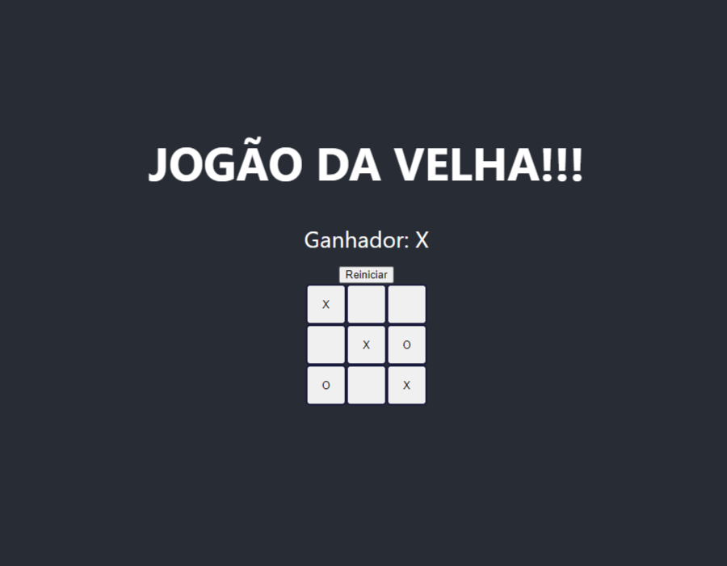

# Jogo da Velha em React

Este projeto é uma implementação do clássico **Jogo da Velha (Tic-Tac-Toe)**, desenvolvida utilizando **React**. O objetivo do jogo é permitir que dois jogadores se enfrentem, alternando turnos até que um deles forme uma linha, coluna ou diagonal com seus símbolos (X ou O), ou que o jogo termine empatado.

## Funcionalidades

- **Jogabilidade para dois jogadores**: O jogo alterna automaticamente entre os jogadores "X" e "O" em cada jogada.
- **Detecção de vitória**: O jogo identifica quando um jogador vence (linha, coluna ou diagonal completa).
- **Reiniciar o jogo**: Ao final de cada partida, os jogadores podem reiniciar o jogo para começar uma nova partida.

## Tecnologias Utilizadas

- **React**: Biblioteca JavaScript utilizada para construir a interface do usuário e gerenciar o estado do jogo.
- **CSS**: Estilização do tabuleiro e das interações visuais do jogo.
- **JavaScript ES6+**: Utilizado para lógica de jogo, gerenciamento de turnos e verificação de vitórias.

## Requisitos

- **Node.js** versão 14 ou superior
- **npm** (gerenciador de pacotes do Node)

Certifique-se de que o Node.js versão 14.x está instalado. Caso precise instalar ou verificar a versão atual do Node.js, siga os passos abaixo:

### Verificar versão do Node.js

Execute o comando no terminal para verificar a versão instalada:

    node -v

## Como Rodar o Projeto

1. Clone este repositório:
   ```bash
   git clone https://github.com/clhobus013/tde1-gco.git
2. Navegue até o diretório do projeto:
    ```bash
    cd tde1-gco
3. Instale as dependências:
    ```bash
    npm installk
4. Inicie o servidor de desenvolvimento:
    ```bash
    npm start
5. Acesse o jogo no seu navegador em: http://localhost:3000

## Captura de Tela




## Estrutura de Componentes
- **Game**: Componente principal que contém o tabuleiro e controla o estado do jogo.
- **Board**: Componente que renderiza o tabuleiro 3x3 e gerencia a interação dos jogadores com as células.
- **Square**: Componente que representa cada célula do tabuleiro.

## Processo de desenvolvimento

O repositório segue um fluxo de desenvolvimento baseado em Git Flow com duas branches principais:
- **main**: Contém o código de produção. Todas as versões finais e estáveis são mantidas aqui.
- **develop**: Branch de desenvolvimento, onde as funcionalidades e correções são integradas antes de serem enviadas para produção.
- As funcionalidades e correções são desenvolvidas em branches dedicadas e unidas à branch develop via Pull Requests.

**Ciclo de Desenvolvimento**
Cada nova funcionalidade, melhoria ou bug deve ser documentado como uma **Issue** no repositório.
Em seguida, pode-se realizar o desenvolvimento da mesma.
Para a organização do repositório, cada funcionalidade ou correção terá a sua branch correspondente nomeada como **feature/nome-da-funcionalidade** ou **bugfix/nome-do-bug**
Após a conclusão do desenvolvimento da funcionalidade ou correção, cria-se um Pull Request da branch de funcionalidade para a branch develop.
Na sequência o código passa por revisão e se aceito, a Pull Request é aprovada e o merge é feito para a branch develop.
Por fim, após finalizada a nova versão, o código é submetido a uma nova pull request para a branch main e recebe o merge após passar por revisão

**Versões (Releases)**
O ciclo de releases será semanal, feitas a partir da branch main, e cada versão será documentada no repositório.

**Correção Emergencial (Hotfix)**
Em caso de bugs críticos encontrados em produção, será criada uma branch hotfix/nome-do-hotfix a partir da branch main.
A correção é implementada diretamente na branch hotfix e, após a revisão, será mesclada nas branches main e develop para garantir que a correção não seja perdida em futuras versões.

**Diagramas e Fluxos**
O fluxo de desenvolvimento segue o seguinte modelo:
